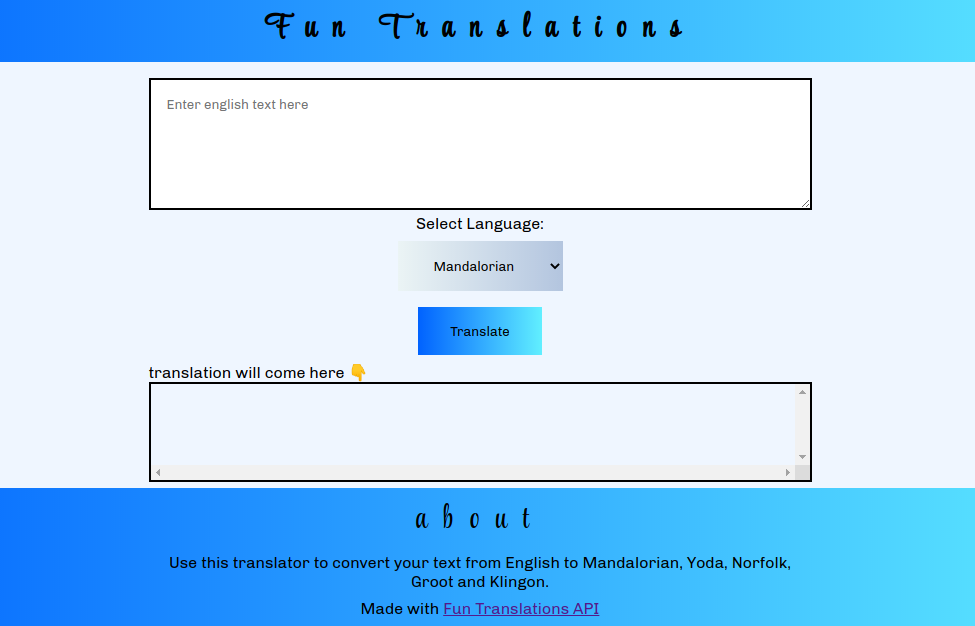

# neoG - Mark-7 Fun Translations App

This is a solution to the [Mark-7 of neoG camp](https://neog.camp/guide/lesson-four#assignment).

## Table of contents

- [Overview](#overview)
  - [The challenge](#the-challenge)
  - [Screenshot](#screenshot)
  - [Links](#links)

## Overview
- Translator to convert your text from English to Mandalorian, Yoda, Norfolk, Groot and Klingon using fun translations api.
### The challenge

1. Attaching events to HTML elements
2. Taking user input in browser
3. Selecting HTML elements using querySelector()
4. Showing ouput in browser
5. Making network calls to get relevant data from fun translatons api
6. Error handling network calls

### Screenshot

### Links

[- Live Site URL](https://git-0r.github.io/mark7_funTranslationsApp/)
